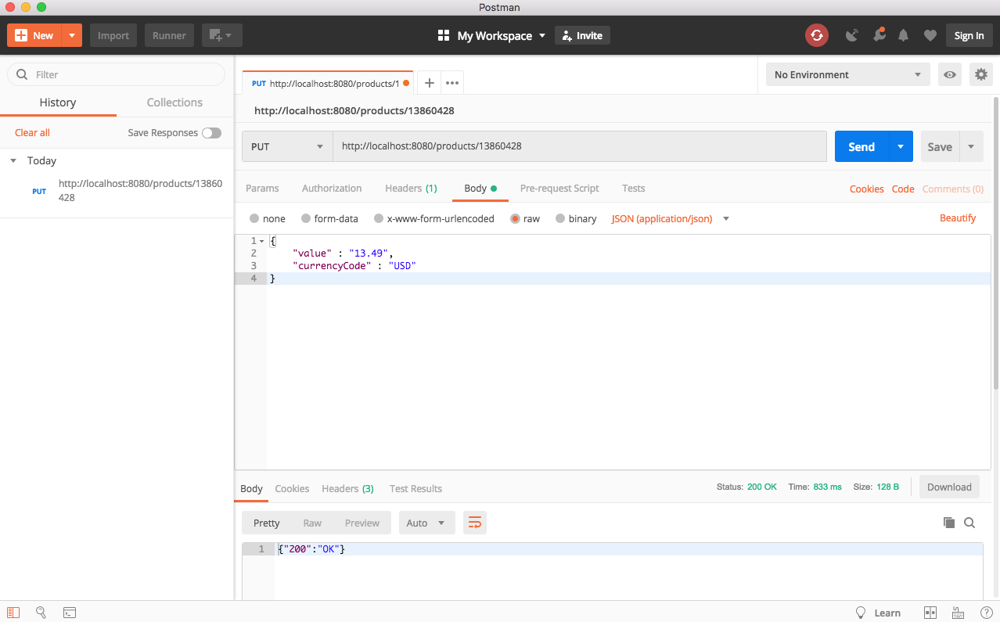

# MyRetail
MyRetail is an end-to-end Proof-of-Concept for a products API, which will aggregate product data from multiple sources and return it as JSON to the caller.

- Responds to an HTTP GET request at /products/{id} and delivers product data as JSON (where {id} is a number).

- Accepts an HTTP PUT request at the same path (/products/{id}), containing a JSON request body similar to the GET response, and updates the product’s price in the database.

## Technology & Framework Used
- [Maven](https://maven.apache.org/)
- [Spring Boot](https://spring.io/projects/spring-boot)
- [MongoDB](https://www.mongodb.com/)


## Prerequisites
#### MongoDB
MyRetail reads product pricing information from a MongoDB database and combines it with the product id and product name from the HTTP request to produce a single response.

Installation instructions provided are for MacOS.

- Install MongoDB using Homebrew ```
brew install mongodb```

- Run Mongo Deamon in terminal ```mongod```

- Run MongoDB in another terminal ```mongo```

- Create a database for Product Prices and insert Product Price data

    ```
    use price
    ```
    ```JSON
    db.price.insertMany( [
      { "_id" : 13860428, "value" : 13.49, "currencyCode" : "USD" },
      { "_id" : 15117729 },
      { "_id" : 16483589 },
      { "_id" : 16696652 },
      { "_id" : 16752456 },
      { "_id" : 15643793 }
    ] )
    ```

## Installation
1. Clone or download git repository
2. Use Maven to build and run the application

    ```
    mvn clean package
    java -jar target/myRetail-1.0-SNAPSHOT.jar
    ```

## Usage
#### HTTP GET Request
Open any web browser and go to http://localhost:8080/products/{id} where id is the product id.

Example: http://localhost:8080/products/13860428

Response:
  ```JSON
  {
    "id": 13860428,
    "name": "The Big Lebowski (Blu-ray)",
    "currentPrice": {
      "value": 13.49,
      "currencyCode": "USD"
    }
  }
  ```

#### HTTP PUT Request
Web browsers do not support HTTP PUT requests.  An easy application we can use is POSTMAN to send the JSON request body to our server.

[Download Postman](https://www.getpostman.com/downloads/)

In Postman application
- Select PUT from drop down list

- In field "Enter request URL", insert url http://localhost:8080/products/{id} where id is the product id

- Click "Body" tab

- Select radio button "raw"

- Select "JSON(application/json)" from drop down list

- Specify the JSON request body with a price value and a price currency for the product

-  Click "Send"

Example:



Response:
  ```JSON
  { "200" : "OK" }
  ```
## Testing

Use Maven to run JUnit Tests ```mvn test```

## Author
Arafa Alam
